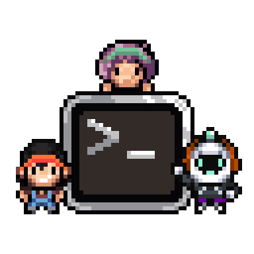
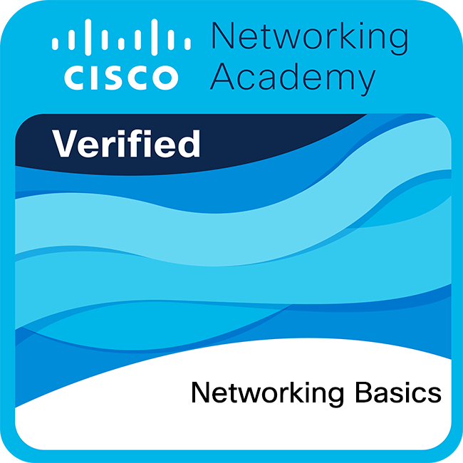
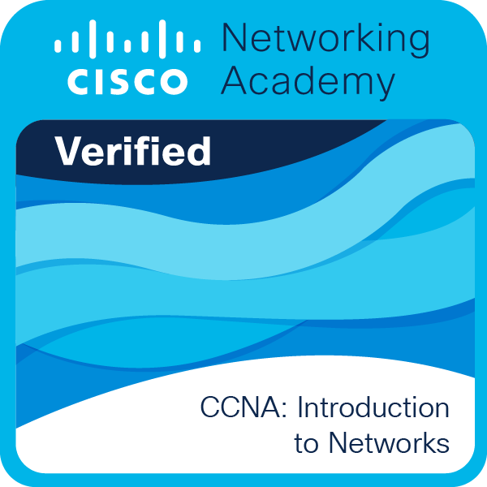
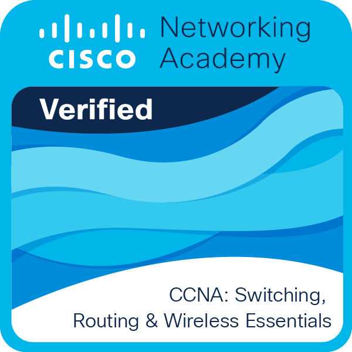

<picture>
  
</picture>

<h1 align="center">Hi 👋, I'm Miko! </h1>
<h3 align="center">私の世界へようこそ、ここではコードがうまく動くように頑張っています... そして、時々成功します！ </h3>
<h4 align="center">Welcome to my world, where I strive to make the code run well... and sometimes I succeed!</h4>

  👋 Hi! I'm <b>Miko</b>, a <i>developer in progress</i> passionate about programming, networks, and microcomputing.

***

🔌 I love creating projects with **Arduino**, **ESP32**, and **M5Stack**, combining IoT and practical solutions. Raspberry Pi (update)  
🌐 Currently learning **Cisco networks**, **artificial intelligence**, and **Robotics**.  

💻 My favorite tools include:
- **Python, Jupiter Notebook, PyCharm, Anaconda, Git + Git Hub , VsCode, Docker**
- **Coffee ☕ (it's technically hardware, but essential for coding).**  
- **Arduino IDE**

🎯 My goal is to merge technology and creativity to develop innovative projects. 

  

## Certifications and Achievements

<table align="center">
  <tr>
    <td align="center" width="250">
      <a href="https://www.credly.com/badges/6fcb686e-3bcb-4c73-ae41-483acab22191/public_url" target="_blank">
        
         <small><b>Networking Basics</b></small>
      </a>
    </td>
    <td align="center" width="250">
      <a href="https://www.credly.com/badges/1198a393-60c7-4fd5-b791-edd71df37828/public_url" target="_blank">
        
         <small><b>Network Technician</b></small>
      </a>
    </td>
    <td align="center" width="250">
      <a href="https://www.credly.com/badges/14b37246-03e7-416f-912f-5f5c7f52bf2b/public_url" target="_blank">
        
         <small><b>CCNA 1</b></small>
      </a>
    </td>
  </tr>
  <tr>
    <td align="center" width="250">
      <a href="https://www.credly.com/badges/4ec1c7e6-e983-4cdf-aba6-a605b073d301/public_url" target="_blank">
        
         <small><b>CCNA 2</b></small>
      </a>
    </td>
    <td align="center" width="250">
      <a href="https://www.credly.com/badges/2c7f91bf-d841-4cfb-af67-e0ef3cd90039/public_url" target="_blank">
        
         <small><b>Cybersecurity Essentials</b></small>
      </a>
    </td>
    <td align="center" width="250">
      <a href="https://www.credly.com/badges/b107d0a8-c264-4280-8e3e-b22170cf1d4c/public_url" target="_blank">
        
         <small><b>Junior Cybersecurity</b></small>
      </a>
    </td>
  </tr>
</table>

## Portfolio

Check out my projects in **Python, Networking, IoT, AI/ML, and Cloud**:  
[Go to Portfolio Repository](https://github.com/NetmikoIO/portfolio/blob/main/README.md)

  <!-- GIF clicable -->
  

## Contact Me

“I’m passionate about learning and building projects, even if I stumble sometimes 😅. Collaboration is always welcome – let’s create something amazing together!
Respect to this incredible community. 🙌”

📫 Want to collaborate? Reach me at: [contacto@netmiko.io](mailto:contacto@netmiko.io)  
🌐 Check out my website: [www.netmiko.io](https://www.netmiko.io)

  

